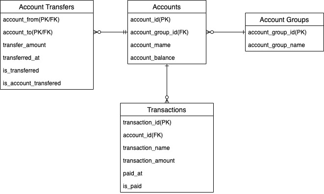
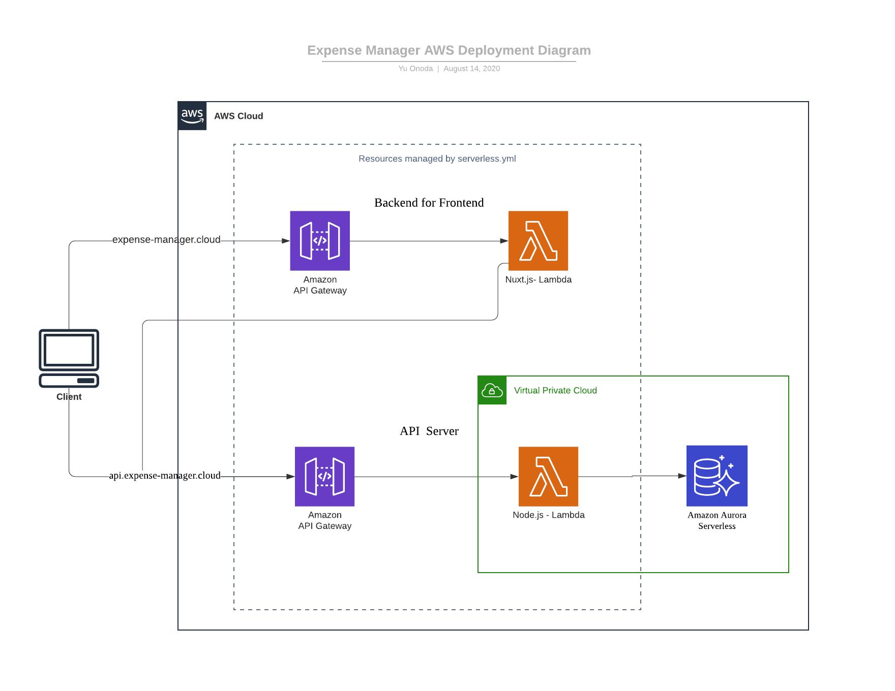

# Overview 
This repository offers the backend system of my expense manager.

# API Endpoints

## Transaction Detail
/transactions/:transaction_id

### GET
Get single transaction

Response
```json
{
    "transaction_id": 1,
    "account_id": 1,
    "transaction_name": "家賃",
    "transaction_amount": 80000,
    "paid_at": "2020-08-31T01:48:09.946Z",
    "is_paid": false,
    "created_at": "2020-08-13T07:52:49.115Z",
    "updated_at": "2020-08-13T07:52:49.115Z",
    "deleted_at": null,
    "version": 0
}
```

### PUT
Update single transaction

Request 
```json
{
    "account_id": 1,
    "transaction_name": "家賃",
    "transaction_amount": 80000,
    "paid_at": "2020-08-31T01:48:09.946Z",
    "is_paid": false
}
```

## Transaction List
/transactions

### GET
Get a list of transactions.

Response
```json
{
    "transactions": [
      ...same as transaction detail
    ]
}
```

### POST
Add a new transaction

Request is same with PUT method of transaction detail

## Acount Detail
### GET
Get a single account detail

Response
```json
{
    "account_id": 1,
    "account_group_id": 1,
    "account_name": "普通預金",
    "account_balance": 400000,
    "created_at": "2020-08-13T07:52:49.107Z",
    "updated_at": "2020-08-13T07:52:49.107Z",
    "deleted_at": null,
    "version": 0
}
```

### PUT 
Uppdate an account detail

Request
```json
{
    "account_group_id": 1,
    "account_name": "普通預金",
    "account_balance": 400000
}
```

## Account List 
/accounts

### GET
Get a list of accounts

Response
```json
{
   "accounts": [
      ... same with account detail
   ]
}
```


## Error Response 
```json
{
  "status": 400,
  "message": "Bad Request",
  "errors": [
    "Account Id cannot be empty",
  ],
}
```


# Database



# AWS Archutetcture

